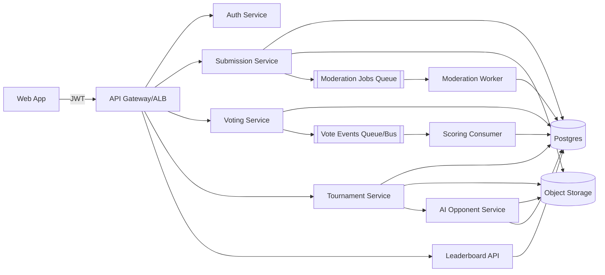

Below is an opinionated, buildable architecture for your “writers vs AI” tournament platform—covering **application design**, **data model**, **core flows**, and **infrastructure**. I’m optimizing for: fairness, auditability, low latency voting, and the ability to iterate quickly without painting yourself into a corner.

---

## Product mechanics to make the system robust

You’re building two things at once:

1. **A submission + tournament system** (chapters, rounds, matchups, leaderboard)
2. **A voting market** (peers vote; incentives + anti-cheat matter more than UI polish)

A few design constraints that should drive architecture:

- **Blind voting**: voters should not know which is human vs AI at vote time.
- **Deterministic scoring**: every rank change must be reproducible from an event log.
- **Sybil resistance**: “writers vote” is not automatically trustworthy.
- **Moderation pipeline**: you’ll get plagiarism, slurs, spam, hate, and adversarial prompt injection attempts.
- **AI fairness**: the AI opponent should be _consistent per matchup_ (same difficulty and style constraints), and its generation should be auditable.

Those constraints point strongly to an **event-sourced voting core** + **separate leaderboard projection**.

---

## High-level architecture (services)

### Client apps

- **Web app** (primary): Next.js (or similar), server-side rendering for SEO + fast onboarding.
- Optional later: Mobile app (React Native) or just a responsive web.

### Backend (core services)

1. **Auth + Identity**
   - writers are both “founders” and “voters”
   - supports email magic links + OAuth (Google) + optional social proof (X/GitHub)
   - issues JWT sessions

2. **Submission Service**
   - handles chapters/passages, metadata, versioning, sanitization
   - stores canonical text + derived representations (chunks, embeddings, reading-time, etc.)
   - enforces rules: length, format, language, cooldowns, daily submission limit

3. **AI Opponent Service**
   - generates the AI story/passages per matchup
   - enforces a _match policy_: same length band, same genre constraints, same reading difficulty
   - logs the exact prompt, model version, seed/temperature, and output hash

4. **Matchmaking / Tournament Service**
   - schedules rounds, creates matchups (writer passage vs AI passage)
   - defines time windows, eligibility, and how many matches per participant
   - can run Swiss-style, ladder, or seasonal leagues

5. **Voting Service (the critical core)**
   - serves blind ballots
   - records votes
   - enforces “one vote per matchup per user”
   - anti-cheat (rate limits, anomaly detection hooks)
   - emits immutable vote events into an event log

6. **Scoring + Leaderboard Service**
   - consumes vote events and updates ratings/leaderboards
   - uses an ELO-like rating system or TrueSkill
   - maintains projections: season leaderboard, weekly leaderboard, “streaks”, etc.

7. **Moderation / Trust & Safety**
   - automated checks: toxicity, sexual content, hate, spam
   - plagiarism detection (at least internal duplicate detection + external provider later)
   - queue for manual review
   - enforcement actions: hide passage, disqualify, shadowban, etc.

8. **Notifications**
   - email + in-app notifications (match ready, results, rank changes, invite to meeting)

### Shared platform components

- **Event bus** for asynchronous workflows (vote recorded → scoring update, etc.)
- **Analytics pipeline** (audit events, funnels, cohort retention)
- **Observability** (logs/metrics/traces)

---

## Data architecture (what you store)

Use a relational database for core entities and a separate event log for immutable votes.

### Relational DB (Postgres)

Core tables:

- `users` (writer identity)
- `writer_profiles` (bio, links, genre tags, verified signals)
- `submissions` (book/project)
- `passages` (chapter/story excerpt content + version)
- `tournaments` (season config)
- `rounds`
- `matchups` (writer_passage_id vs ai_passage_id, window, status)
- `ballots` (what the voter saw, including randomized order)
- `votes` (a _pointer_ to the immutable event, plus de-dupe constraints)
- `moderation_flags`, `moderation_actions`
- `invites` (meeting invites; deal workflow later)

### Object storage (S3/GCS)

- canonical passage text files (optional; or store in Postgres if short)
- rendered/normalized versions
- AI outputs as immutable blobs
- evidence artifacts for moderation (snapshots)

### Event log (append-only)

- `VoteCast` events are the source of truth
- store in Kafka topic + long-term in object storage, or a dedicated event store
- each event includes: voter_id, matchup_id, ballot_id, chosen_option, timestamp, client fingerprint hash, policy version

### Search / retrieval

- OpenSearch/Elasticsearch for:
  - fast “discover passages”
  - moderation queries
  - similarity search if you also store embeddings (or use pgvector in Postgres)

### Embeddings (optional early, valuable later)

- use `pgvector` in Postgres first; it’s enough until you’re big
- embeddings support:
  - duplicate detection / plagiarism heuristics
  - genre clustering and better matchmaking
  - personalized feed (“passages you should vote on”)

---

## Core flows

### 1) Writer submits a passage

1. Client → Submission Service (`POST /passages`)
2. Service:
   - validates length, language, formatting
   - normalizes text (unicode normalization, whitespace policy)
   - stores canonical + creates “content hash”

3. Emits event: `PassageSubmitted`
4. Moderation pipeline runs async:
   - immediate auto checks (toxicity etc.)
   - if suspicious → set status `PENDING_REVIEW`
   - else `APPROVED`

### 2) Matchup creation (writer vs AI)

1. Tournament Service selects eligible approved passages
2. For each writer passage, create a matchup shell
3. AI Opponent Service generates AI passage with fixed constraints:
   - same approximate length band
   - same genre label or neutral style baseline
   - fixed policy per season (model+prompt template versioned)

4. Persist `ai_passage` and its generation metadata
5. Matchup moves to `OPEN_FOR_VOTING`

### 3) Voting (blind ballot)

1. Voter asks for next ballot: `GET /ballots/next`
2. Voting Service:
   - selects an open matchup the voter hasn’t seen
   - constructs a ballot with randomized A/B ordering
   - stores the ballot (so the vote is auditable)

3. Voter chooses A or B, submits: `POST /votes`
4. Voting Service:
   - enforces dedupe: unique(voter_id, matchup_id)
   - writes immutable event `VoteCast` to event bus/event store
   - writes a relational row referencing that event id

5. Scoring service consumes the `VoteCast` and updates:
   - matchup tally
   - writer rating
   - AI rating (global or per-style bucket)

### 4) Leaderboard updates

Use **projection**:

- `leaderboard_current` table is updated by the scoring consumer
- rebuildable from the event stream if needed (important for trust)

### 5) Promotion/demotion logic

Don’t literally “demote when AI wins more votes”—that’s too noisy and gameable.

Do this instead:

- Treat each matchup outcome as a match result:
  - if writer gets >50% votes → writer win
  - else writer loss

- Update writer rating using ELO/TrueSkill
- Leaderboard = rating + eligibility filters (minimum votes, minimum matches)

This yields:

- smooth rankings
- hard to manipulate with a few fake votes
- scalable logic for seasons

---

## Anti-cheat & integrity (you need this on day 1)

You will get collusion (“vote my passage, I’ll vote yours”), sockpuppets, and brigading.

Minimum viable defenses:

### Identity / access

- email verification
- rate limits by IP + device fingerprint hash
- CAPTCHA on signup and on suspicious patterns
- optional: require “participation stake”:
  - to be eligible for leaderboard, must cast N votes/week
  - to vote, must have submitted at least one passage (you already want this)

### Voting constraints

- one vote per matchup per user (hard constraint)
- cooldown between votes (e.g., 5–10 seconds)
- limit daily votes unless trusted

### Anomaly detection (async)

A “Trust Scoring” job that flags:

- new accounts voting almost exclusively for one writer
- high correlation voting rings (graph analysis)
- fast vote cadence
- repeated IP/device clusters

### Penalties

- downweight votes from low-trust accounts in scoring (soft defense)
- shadowban voters rather than hard banning (harder to adversarially adapt)

**Important**: if you downweight, you must store:

- raw vote
- trust score at time of vote
- scoring weight version
  …so outcomes remain explainable.

---

## Moderation architecture (non-negotiable)

Pipeline:

1. Synchronous checks on submission:

- length, allowed chars, obvious disallowed content

2. Async checks:

- toxicity / hate / sexual content classifier
- similarity checks vs prior passages (internal near-duplicate)
- “prompt injection” patterns (if you ever let user text influence your AI prompts, you need sanitization)

3. Manual review queue:

- reviewers see passage, flags, similarity hits
- actions are recorded immutably (`ModerationActionApplied`)

Statuses:

- `APPROVED` → can enter matchups
- `PENDING_REVIEW`
- `REJECTED`
- `DISQUALIFIED` (for tournament/season)

---

## Infrastructure (opinionated, scalable, not overkill)

You can run this on AWS or GCP. I’ll describe an AWS baseline that’s clean.

### Network

- VPC with public + private subnets across 2–3 AZs
- ALB (public) → app services (private)
- NAT gateway for private egress

### Compute

**Phase 1 (fastest to ship):**

- Serverless + managed:
  - API on ECS Fargate or Lambda
  - event bus via SQS/SNS (simple)
  - Postgres via RDS
  - Redis via ElastiCache (for rate limits / sessions / leaderboard cache)
  - S3 for blobs

**Phase 2 (when you need throughput):**

- EKS or ECS + Kafka (MSK)
- separate consumers for scoring, moderation, notifications

I’d start with **ECS Fargate** (simpler than EKS, still containerized), and move to Kafka/MSK only when vote volume demands it.

### Storage

- RDS Postgres (Multi-AZ)
- S3 (versioning on)
- OpenSearch (optional early; can wait)
- Redis (ElastiCache)

### Eventing / async

Start:

- SQS queues:
  - `vote-events` (or you write votes to DB then enqueue a message)
  - `moderation-jobs`
  - `notifications`

Later:

- Kafka (MSK) for higher volume and replayability

### Observability

- OpenTelemetry tracing
- CloudWatch logs + metrics
- Sentry (frontend + backend)
- audit dashboard for votes + leaderboards

### Secrets & config

- AWS Secrets Manager for DB creds, API keys
- Parameter Store for non-secret config

### CI/CD

- GitHub Actions:
  - build images
  - deploy to ECS (blue/green with CodeDeploy or rolling updates)

- IaC: Terraform (or Pulumi if your team prefers)

---

## API surface (what endpoints exist)

You’ll want crisp boundaries:

### Auth

- `POST /auth/start` (email magic link)
- `POST /auth/verify`
- `GET /me`

### Submissions

- `POST /submissions`
- `POST /passages`
- `GET /passages/:id`
- `GET /me/passages`

### Tournament

- `GET /tournaments/current`
- `GET /leaderboard?season=...`
- `GET /me/rating`

### Voting

- `GET /ballots/next`
- `POST /votes` (ballot_id + choice)
- `GET /matchups/:id/result` (only after voting closes)

### Moderation (internal/admin)

- `GET /admin/mod-queue`
- `POST /admin/mod-action`

---

## Scoring model recommendation

Use **TrueSkill** if you plan many short matches and want stable rankings with uncertainty; otherwise **ELO** is fine.

My recommendation:

- Start with ELO for simplicity.
- Add minimum sample requirements:
  - must have ≥ X matchups and ≥ Y votes received to appear on the main leaderboard

- Add decay or “season reset” to keep it competitive.

**AI rating**:

- Either fixed baseline (AI is just an opponent, not a ranked entity)
- Or maintain an AI rating per “difficulty tier” so you can tune the AI over time without breaking historical comparability

If you change AI difficulty mid-season, version it and treat it like a new opponent pool.

---

## “AI generation” details that matter

You must log generation metadata for trust:

- model id/version
- prompt template version
- system message policy version
- temperature/top_p
- max tokens
- output hash
- safety filter results

Also: **never feed user-submitted content directly into the AI prompt** in a way that lets them inject instructions that change the AI’s behavior. If you need “same theme,” do theme extraction via a constrained classifier step, not raw prompt inclusion.

---

## Minimal viable system (what to build first)

If you want to ship in ~weeks, not months, the MVP is:

1. Auth (magic link)
2. Passage submission + basic moderation checks
3. Tournament scheduler (cron job creates matchups daily)
4. AI generation service (sync generation at matchup creation time)
5. Voting (blind ballots) + vote event log
6. ELO scoring + leaderboard projection
7. Admin screen for moderation + disqualifications

Everything else is iteration.

---

## Mermaid diagram (safe syntax)

---

## Assumptions I made (so you can correct them)

- Voting is **asynchronous** (not real-time head-to-head duels).
- Passages are **short enough** to render and vote on comfortably (e.g., 300–1500 words).
- You want a **season-based leaderboard**, not a single perpetual ladder.
- You’ll run **one canonical AI opponent policy per season**.

---

## Clarifying questions for next turn (answer any subset)

1. What’s your expected scale in year 1: **100 writers, 1k, 10k**?
2. Do you want **public voting visibility** (people can share passages) or strictly internal to writers?
3. Are passages **only English** or multi-language?
4. Do you want the AI opponent to be **genre-matched** (e.g., “fantasy vs fantasy”), or always a neutral style?
5. Do you want this to feel like a **continuous ladder** or **weekly tournaments with finals**?

If you answer these, I’ll lock the tournament format + scoring + infra sizing into a concrete deployment plan (DB sizing, queue throughput, caching, and cost envelope).
